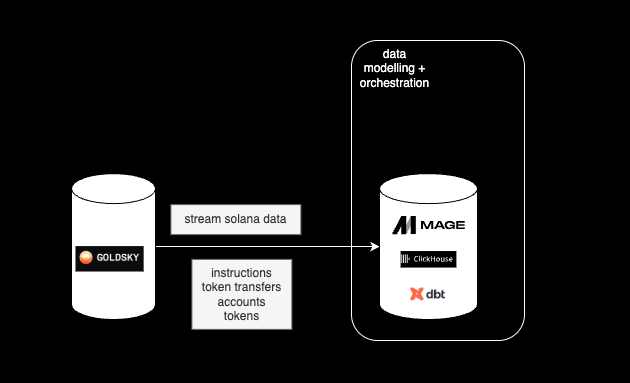

# 🏷 Generating Wallet Tags for Solana Wallets  
 Helping investors make smarter decisions through on-chain labels

---

## 💡 Problem Statement

> **Create a pipeline that produces valuable labels for blockchain addresses. These labels should be useful to an investor who wants to better understand interesting addresses on chain, and help them make smarter decisions.**

---

## 🎯 User-Centric Design

- **What makes a label valuable?**
  - Helps investors identify high-signal wallets based on PnL and activity patterns.
  - Distinguishes wallet types (e.g., DEX traders, funds, whales, long-term holders).
  - Enables actionable insights by reflecting wallet activity over different time horizons (1h, 1d, 3d, 7d, 30d).
  - Supports segmentation — group wallets with similar behavior for deeper analysis.
  - Facilitates filtering and sorting in UI tools to help users focus on relevant wallets.

---

- **End-user focus**
  - Tags should be **clear, consistent, and interpretable** — ideally unique and mutually exclusive where possible.
  - Provide a **wide range of tags** tailored to different user needs:  
    - *Investors* → `Smart Money`, `Whale`, `Fund`  
    - *Protocol builders* → `Heavy User`, `Bot`  
    - *Researchers* → `Bridge User`, `Mixing Activity`
  - Insights must be **timely** — labels should reflect *current* wallet activity, updated regularly (1h, 1d, 3d, 7d, 30d)
  - Enable users to **create segments of wallets** by similar patterns for discovery and monitoring.

---

## ⚠️ Considerations & challenges

- Finding good quality indexed Solana dataset (not an EVM chain)
- Produce a data model that captures the complex relationship between transactions, accounts, token transfers & instructions 
- Ensure the data platform supports high TPS (Solana = high-throughput chain) and high read
- Handle blockchain reorganizations (e.g. forks, chain reorgs) gracefully.
- What are useful tags based on trading behavior, what should the time horizons be? (1h, 1d, 1w, 1m?)
- Prevent feature leakage in tagging models (e.g. avoid double counting signals like transaction count and volume).
- Keep tags fresh without excessive recomputation → balance between batch and incremental updates.

---

## 🚀 Milestones & Tasks

### Milestones:
1️⃣ Set up streaming + storage  
2️⃣ Build aggregated wallet activity models  
3️⃣ Wallet heuristics train + deploy wallet tagger  
4️⃣ Serve labels to end-users

---

### Tasks per Milestone

- **1️⃣ Top priority: Streaming + Storage** 
  - Connect Goldsky to ClickHouse (append-only mode).
  - Set up base tables with dbt (transactions, instructions, token accounts, tokens, token transfers).
  - Setup orchestration

- **2️⃣ Aggregation & Features**
  - DBT models: wallet-level aggregates (balance, tx count, token types).
  - Handle time windows (1h, 1d, 3d, 7d, 30d).

- **3️⃣ Machine Learning**
  - Feature engineering: volume, DEX interactions, clustering.
  - XGBoost classifier + graph embeddings.

- **4️⃣ Label Serving**
  - API
  - Materialized views for fast queries. Experiment with clustering and partitioning to improve performance on read.

---

## 🏗️ Architecture

---

## 🏗️ Stack

- Clickhouse is a columnar based storage that supports fast reads and fast writes, ideal for blockchain analytical workloads

- Goldsky is a blockchain indexer which can stream or mirror data into your database. Goldsky supports Solana and handles reorgs for you. Caveat: data quality is not the best.

- dbt is a versatile tool for building data models for analytics use cases with version control and good data testing coverage

- Mage.ai is a relatively new data orchestration tool that has native Clickhouse and dbt integration and simplifies a lot of data engineering workload
---

## 🏗️ Approach

- Stream indexed Solana data (tokens, accounts, token_transfers, transactions, instructions) into Clickhouse using Goldsky.

- Create a clean transfers table serving as a basis for wallet level aggregates, which will in turn be used for heuristics + feature engineering for supervised/unsupervised ML loads.

- Nice to have: implement orchestration with Mage.ai, but to develop a POC for wallet tagging, it is not crucial, as long as there is data for several days.

- Transfers table will eventually be rolled up into accounts table, the accounts table holds the initial balances of received tokens ➡ balance at time (t) = starting balance (t-1) + inflow - outflow. Inflow and outflows should come from transfers table.

- This allows us to calculate PnL over time per wallet and token combination, using FIFO heuristic and a rolling average for the cost price to determine the PnL.

---

## Smart Money tags

- A final wallets table will hold the following aggregates:
    - Transactions count (column per 1h, 1d, 3d, 7d, 30d)
    - Transaction usd volume (column per 1h, 1d, 3d, 7d, 30d)
    - Nested field with dictionary of tokens and token usd balance
    - One aggregated total usd wallet balance field + ideally single column for BTC, ETH and SOL balance.
    - PnL (column per 1h, 1d, 3d, 7d, 30d)

- This allows us to create the following tags:
    - Smart Money: top 10 of consistently profitable wallets across all time horizons (1h, 1d, 3d, 7d, 30d) 
    - Smart 30d Dex Trader: top 30% of 30d profitable traders
    - 7D Smart Dex Trader: top 30% of 7d profitable traders
    - Token Millionaire: Has a token balance of at least $1,000,000
    - Active Token Millionaire: Top 1000 Token Millionaires that are most active for the past 30 days (based on 30d transaction count and aggregated token balance)

---

## Challenges faced

Goldsky's Solana dataset is not the cleanest, I have encountered the following issues, leading to longer development times:

- Having to rely on Solana instructions (a huge table) as a safe bet, unfortunately the existing token_transfers table does not have an index field like instructions has, indicating the order of solana instructions within a transaction. This is challenging because there is otherwise no way to find out which address initiated a transaction, which authority signed, which address received tokens and in which mint etc, they appear in random order within a transaction.

- Having to join back onto transactions table to check if transactions failed or not based on status field.

- Applying heuristics to create a deterministic data transformation logic to arrive to a consolidated transfers table. The heuristics can be found in the int_transfers table. Assumptions per transaction: first authority encountered from top to bottom indicates wallet sending and receiving tokens, last mint in last index indicates the mint of token received, the destination token account is in the destination field where index = max(index) etc.

---

## Final outcome

